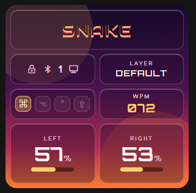

# NEXUS

**A reusable smart dongle platform for ZMK.** Display, dashboard, games, sound
and ZMK Studio on an nRF52840, as a module you drop into the `zmk-config` you
already have.

<p align="center">
  
</p>

```
  POWER ON  →  SPLASH  →  HOME  ─action─►  GAME CENTER  ─action─►  TETRIS
                            │
                            └─hold─►  SETTINGS · DIAGNOSTICS · ABOUT
```

## What it is

A dedicated ZMK split central with a 240x240 ST7789 in front of it:

- **Live dashboard** -- layer, WPM, both halves' batteries, modifiers, caps
  lock, USB/BLE endpoint and profile.
- **Game Center** with a fully playable Tetris. Real rules, real scoring, real
  levels, persistent high scores.
- **Seven themes**, glassmorphism and neumorphism, drawn without ever asking an
  nRF52840 to blur a framebuffer.
- **Configurable splash** -- your PNG, converted at build time from your own
  config repo. No C arrays, no NEXUS source edits.
- **Passive buzzer sound engine**, synthesised rather than sampled.
- **ZMK Studio**, the official integration, untouched.

## What it is not

It is not a keyboard definition. `nexus_dongle` is hardware only -- display,
buzzer, button, central role -- so it composes with your existing Sofle,
Corne, Lily58 or anything else rather than replacing it. Your halves keep their
firmware and compile zero lines of NEXUS.

It is also not allowed to break your keyboard. Unplug the display, the buzzer
and the button and ZMK keeps typing. That is the first requirement, not the
last.

## Quick start

```yaml
# config/west.yml
  projects:
    - name: nexus
      remote: nexus          # url-base: https://github.com/vaibhav8600-rgb
      revision: v1.0.0
```

```yaml
# build.yaml
  - board: nice_nano_v2
    shield: nexus_dongle sofle_dongle
    snippet: studio-rpc-usb-uart
    artifact-name: nexus_dongle
```

Then append [`examples/nexus-config/config/nexus.conf`](examples/nexus-config/config/nexus.conf)
to your dongle's `.conf`. That is the whole integration.

No keyboard wired up yet? Build `shield: nexus_dongle nexus_dongle_demo` -- it
needs nothing else and boots straight into the UI.

Full walkthrough: **[docs/installation.md](docs/installation.md)**.

## Hardware

An nRF52840 ProMicro-compatible board, an ST7789 240x240 module, a passive
buzzer and two tactile switches.

| Signal | Pin |
| --- | --- |
| SCK / SDA | P0.17 / P0.20 |
| RST / DC / CS | P0.22 / P0.24 / P0.11 |
| Backlight | tied to VCC |
| Buzzer | P0.29 |
| Action button | P0.31 |
| Reset | MCU `RST` |

> The requirements document ships two mappings that disagree on `CS`, `BL` and
> the buzzer. NEXUS follows the wiring diagram, and switching to the other
> mapping is a two-line overlay edit.
> **[docs/hardware.md](docs/hardware.md#pin-map)** has both, side by side.

## Documentation

| | |
| --- | --- |
| [hardware.md](docs/hardware.md) | Pin map, the pin conflict, wiring, backlight variants |
| [installation.md](docs/installation.md) | Adding NEXUS to an existing config |
| [configuration.md](docs/configuration.md) | Every option, and what the button does on each screen |
| [splash.md](docs/splash.md) | Custom artwork from your own repo |
| [themes.md](docs/themes.md) | The seven palettes, and how the glass is faked |
| [games.md](docs/games.md) | Playing Tetris, and adding a game |
| [zmk-studio.md](docs/zmk-studio.md) | Studio setup and what NEXUS guarantees |
| [architecture.md](docs/architecture.md) | How it fits together, and what was deliberately left out |
| [development.md](docs/development.md) | Local builds, host tests, hardware test procedure |
| [troubleshooting.md](docs/troubleshooting.md) | Symptom → cause |

## Design in one paragraph

NEXUS renders as ZMK's custom status screen, so ZMK already owns the display
and the work queue and NEXUS adds **no thread of its own**. The UI is a strip
compositor: a 240x240 RGB565 frame is 115 KB and will not fit next to BLE and
Studio, so the screen is composited one 240x12 band at a time into 5,760 bytes
of static RAM. That also makes the glass real rather than faked -- an alpha
tint over a linear gradient is exactly what a backdrop blur would produce --
and makes partial repaint free. ZMK events land in one adapter file, update one
status struct, and fan out as a changed-bitmask, so a WPM tick pushes four
bands instead of twenty. The physical button, the
`&nexus_action` keymap behavior and the UI all emit the same logical actions,
so Tetris cannot tell a finger from a keycap. Rules live in
[`tetris_core.c`](src/games/tetris/tetris_core.c), which includes nothing but
`<string.h>` and therefore has real unit tests that run in a second. There is
no game loop anywhere.

## Tests

```sh
cc -std=c11 -Wall -Wextra -Werror -o /tmp/tt \
   tests/tetris/test_tetris.c src/games/tetris/tetris_core.c && /tmp/tt
python3 tests/splash/test_png2c.py
```

CI runs both on every push, again under ASan/UBSan, builds firmware in ZMK's
container, and fails the build if a GPIO number or a brand string appears in
source that should not contain one.

## Status

v1.0.0. Written against ZMK `main` as of 2026-09 and **not yet flashed to
hardware** -- the bring-up checklist in
[development.md](docs/development.md#hardware-test-procedure) is the honest
definition of done.

## License

MIT. See [LICENSE](LICENSE).
