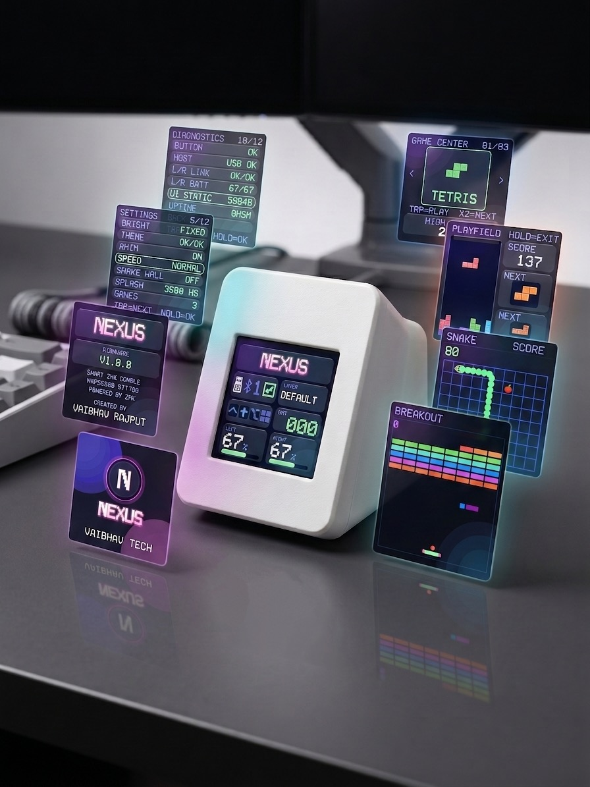
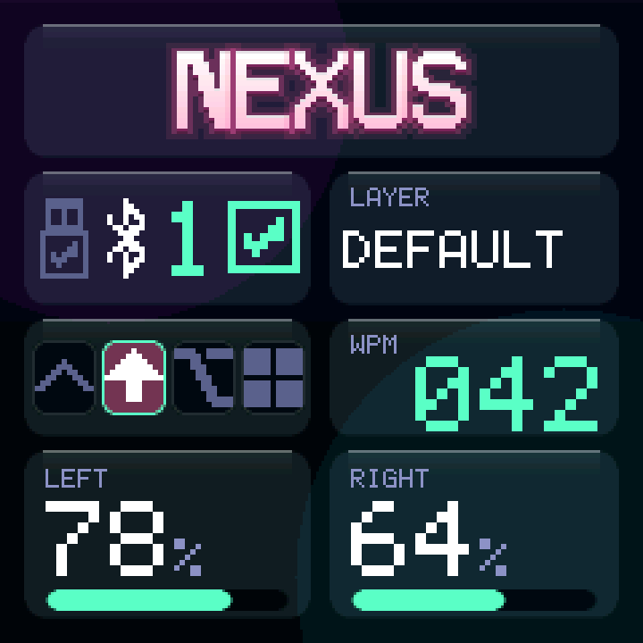
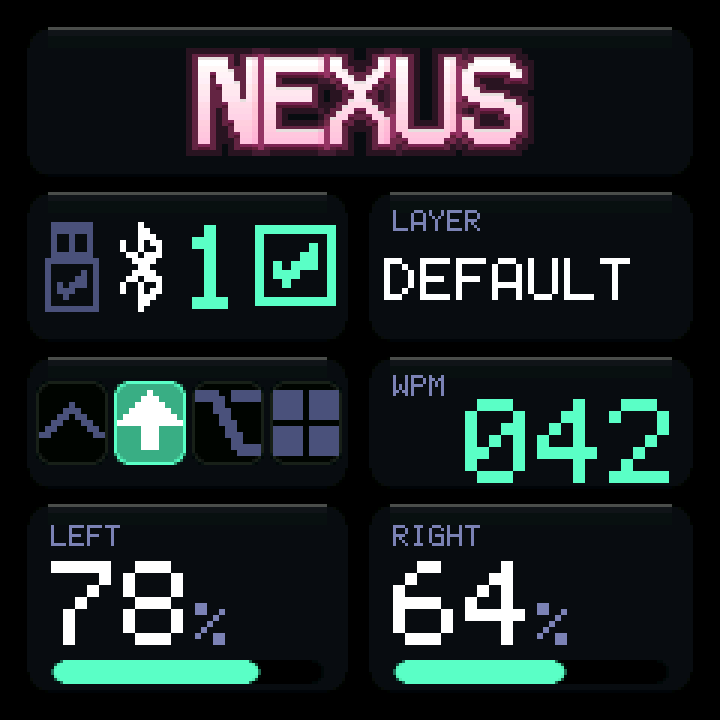
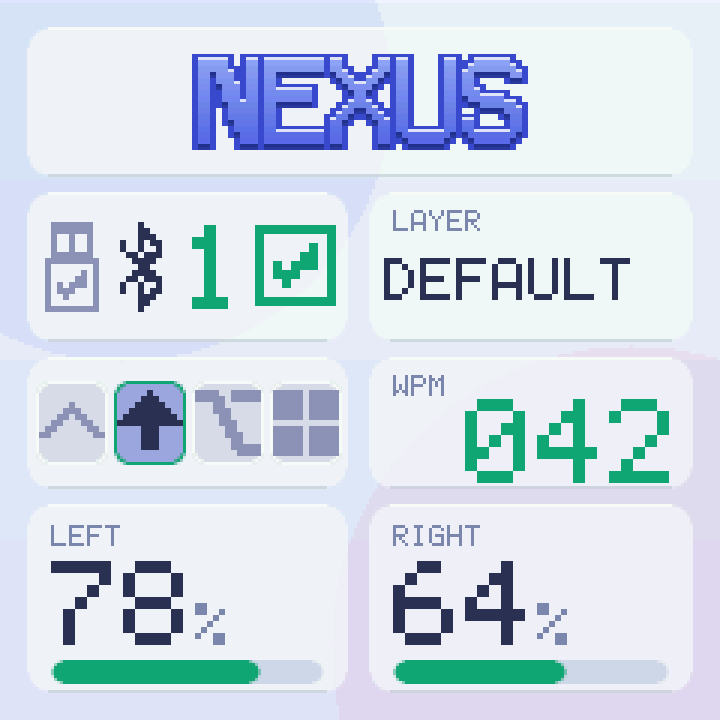
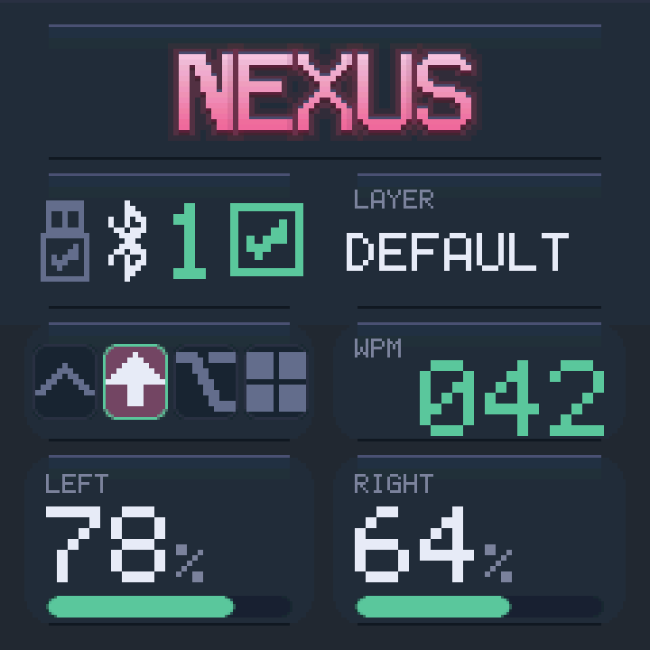
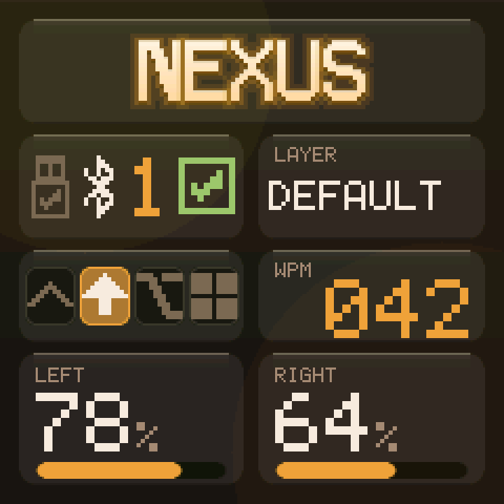
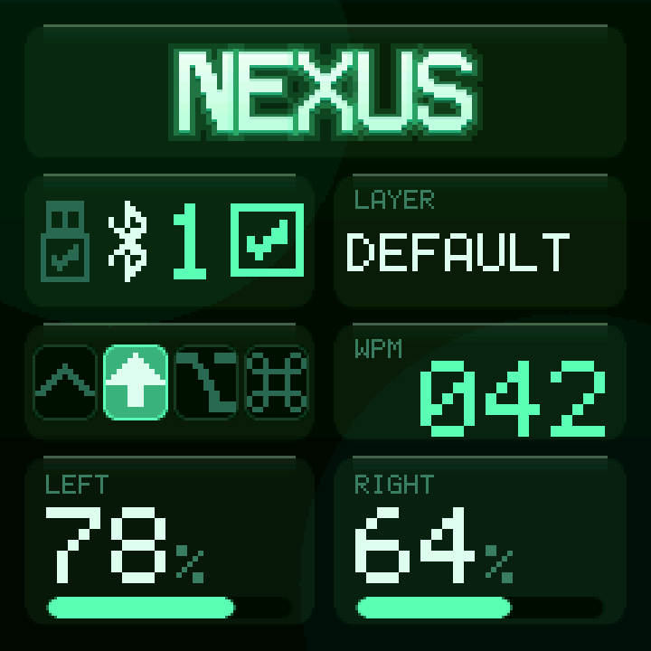
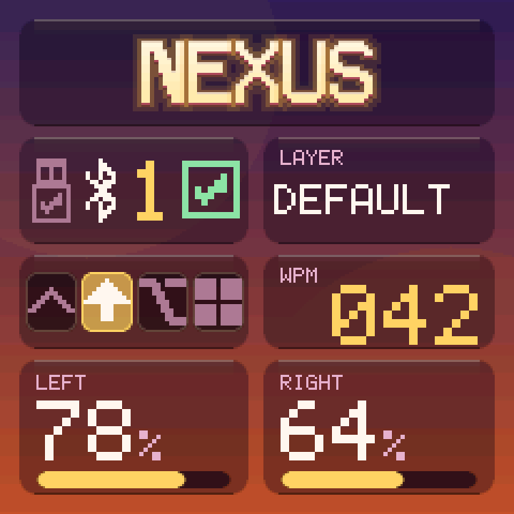

# NEXUS

**A reusable smart dongle platform for ZMK.** Display, dashboard, games, sound
and ZMK Studio on an nRF52840, as a module you drop into the `zmk-config` you
already have.

<p align="center">
  
</p>

```
  POWER ON  →  SPLASH  →  HOME  ─tap─►  GAME CENTER  ─tap─►  TETRIS · SNAKE · BREAKOUT
                            │
                            └─hold─►  SETTINGS · DIAGNOSTICS · ABOUT
```

Every screen, pixel for pixel, is in **[ui.md](docs/ui.md)** -- generated from
the firmware source by `scripts/render_ui.py` (same fonts, same glyph bitmaps,
same palettes, same draw order) and regenerated and diffed in CI, so the docs
cannot show a UI the code stopped drawing.

## What it is

A dedicated ZMK split central with a 240x240 ST7789 in front of it:

- **Live dashboard** -- layer, WPM, both halves' batteries, modifiers, caps
  lock, USB/BLE endpoint and profile.
- **Game Center** with three playable games -- Tetris, Snake and Breakout.
  Real rules, real scoring, persistent high scores, and a difficulty knob in
  Settings so you never reflash to change how a game feels.
  ([watch them play](docs/ui.md#games))
- **Seven themes**, glassmorphism and neumorphism, drawn without ever asking an
  nRF52840 to blur a framebuffer.

<p align="center">
  
  
  
  
  
  
  
</p>
- **Configurable splash** -- a drawn badge by default, or your own PNG
  converted at build time from your config repo. No C arrays, no NEXUS
  source edits.
- **Passive buzzer sound engine**, synthesised rather than sampled.
- **ZMK Studio**, the official integration, untouched.

## What it is not

It is not a keyboard definition. `nexus_dongle` is hardware only -- display,
buzzer, button, central role -- so it composes with your existing Sofle,
Corne, Lily58 or anything else rather than replacing it. Your halves keep their
firmware and compile zero lines of NEXUS.

It is also not allowed to break your keyboard. Unplug the display, the buzzer
and the button and ZMK keeps typing. That is the first requirement, not the
last.

## Quick start

```yaml
# config/west.yml
  projects:
    - name: nexus
      remote: nexus          # url-base: https://github.com/vaibhav8600-rgb
      revision: v1.0.0
```

```yaml
# build.yaml
  - board: nice_nano@2.0.0//zmk
    shield: nexus_dongle sofle_dongle
    snippet: studio-rpc-usb-uart
    artifact-name: nexus_dongle
```

Then append [`examples/nexus-config/config/nexus.conf`](examples/nexus-config/config/nexus.conf)
to your dongle's `.conf`. That is the whole integration.

No keyboard wired up yet? Build `shield: nexus_dongle nexus_dongle_demo` -- it
needs nothing else and boots straight into the UI.

Full walkthrough: **[docs/installation.md](docs/installation.md)**.

## Hardware

An nRF52840 ProMicro-compatible board, an ST7789 240x240 module, a passive
buzzer and two tactile switches.

| Signal | Pin |
| --- | --- |
| SCK / SDA | P0.17 / P0.20 |
| RST / DC / CS | P0.22 / P0.24 / P0.11 |
| Backlight | tied to VCC |
| Buzzer | P0.29 |
| Action button | P0.31 |
| Reset | MCU `RST` |

> The requirements document ships two mappings that disagree on `CS`, `BL` and
> the buzzer. NEXUS follows the wiring diagram, and switching to the other
> mapping is a two-line overlay edit.
> **[docs/hardware.md](docs/hardware.md#pin-map)** has both, side by side.

## Documentation

| | |
| --- | --- |
| [hardware.md](docs/hardware.md) | Pin map, the pin conflict, wiring, backlight variants |
| [installation.md](docs/installation.md) | Adding NEXUS to an existing config |
| [configuration.md](docs/configuration.md) | Every option, and what the button does on each screen |
| [ui.md](docs/ui.md) | Every screen and symbol, the themes, what the button does |
| [splash.md](docs/splash.md) | Custom artwork from your own repo |
| [themes.md](docs/themes.md) | The seven palettes, and how the glass is faked |
| [games.md](docs/games.md) | The three games, difficulty, and adding your own |
| [zmk-studio.md](docs/zmk-studio.md) | Studio setup and what NEXUS guarantees |
| [architecture.md](docs/architecture.md) | How it fits together, and what was deliberately left out |
| [development.md](docs/development.md) | Local builds, host tests, hardware test procedure |
| [troubleshooting.md](docs/troubleshooting.md) | Symptom → cause |

## Design in one paragraph

NEXUS renders as ZMK's custom status screen, so ZMK already owns the display
and the work queue and NEXUS adds **no thread of its own**. The UI is a strip
compositor: a 240x240 RGB565 frame is 115 KB and will not fit next to BLE and
Studio, so the screen is composited one 240x12 band at a time into 5,760 bytes
of static RAM. That also makes the glass real rather than faked -- an alpha
tint over a linear gradient is exactly what a backdrop blur would produce --
and makes partial repaint free. ZMK events land in one adapter file, update one
status struct, and fan out as a changed-bitmask, so a WPM tick pushes four
bands instead of twenty. The physical button, the
`&nexus_action` keymap behavior and the UI all emit the same logical actions,
so Tetris cannot tell a finger from a keycap. Rules live in
[`tetris_core.c`](src/games/tetris/tetris_core.c), which includes nothing but
`<string.h>` and therefore has real unit tests that run in a second. There is
no game loop anywhere.

## Tests

```sh
cc -std=c11 -Wall -Wextra -Werror -o /tmp/tt \
   tests/tetris/test_tetris.c src/games/tetris/tetris_core.c && /tmp/tt

for t in tests/*/test_*.py; do python3 "$t" || break; done
```

The Python suites need no board and no toolchain -- they re-derive each
screen's geometry and each game's rules from the C and assert the things that
cannot be seen by reading a diff.

CI runs both on every push, again under ASan/UBSan, builds firmware in ZMK's
container, and fails the build if a GPIO number or a brand string appears in
source that should not contain one.

## Status

v1.0.0, **running on hardware** -- an nRF52840 dongle driving a 240x240
ST7789, paired to a split Sofle. Built against ZMK `main` as of 2026-09.

Exercised on the real thing, not just in CI: the splash (drawn badge and a
config-repo PNG), the dashboard, all three games, Settings and its persistence
across reflashes, the sound engine, split half connect and disconnect, BLE to
phones, laptops and a TV, USB, and ZMK Studio over the USB transport.

If you are bringing up your own board, the checklist in
[development.md](docs/development.md#hardware-test-procedure) is still the
order worth doing it in -- most of what it lists is what shook these out.

## License

MIT. See [LICENSE](LICENSE).

## Special thanks

**[@joaopedropio](https://github.com/joaopedropio)**, whose snake dongle
module is the base this was built on.

The debt is specific, and it is all over this repo:

- **The connectivity cluster.** Transport, profile number and status tile as
  three separate elements rather than one clever icon -- because a single
  highlighted symbol cannot say "BLE is selected but that profile has never
  paired". The USB plug whose body reports whether HID is actually up, and the
  bordered tile with its three states, are that model.
- **Sizing that turned out to matter.** The 27x27 status tile and the 22x22
  modifier glyphs are the sizes snake-module uses, arrived at there first;
  every attempt here to shrink them made the cluster unreadable.
- **The 12px game board.** Snake's cells are the size they are because the
  8px version was four faint slivers on a panel you read from across a desk.
- **`SPIM0`.** Known-good on this hardware, and the answer to a display bring-up
  problem that cost real time before checking what already worked.

It also saved time by being honest about what it had not solved: its
`peripheral_status.c` handler is an empty stub with *"do we need this ?"* in
it, which was the fastest possible confirmation that ZMK's split central
raises no connect or disconnect events to subscribe to. NEXUS ended up going
to `bt_conn` callbacks directly -- a different answer, reached much sooner for
having seen the question already asked.

None of its code is here, and every difference is deliberate. But the parts
above are its design decisions, and NEXUS is better for having started from
something that already worked on real hardware rather than from a blank file.
