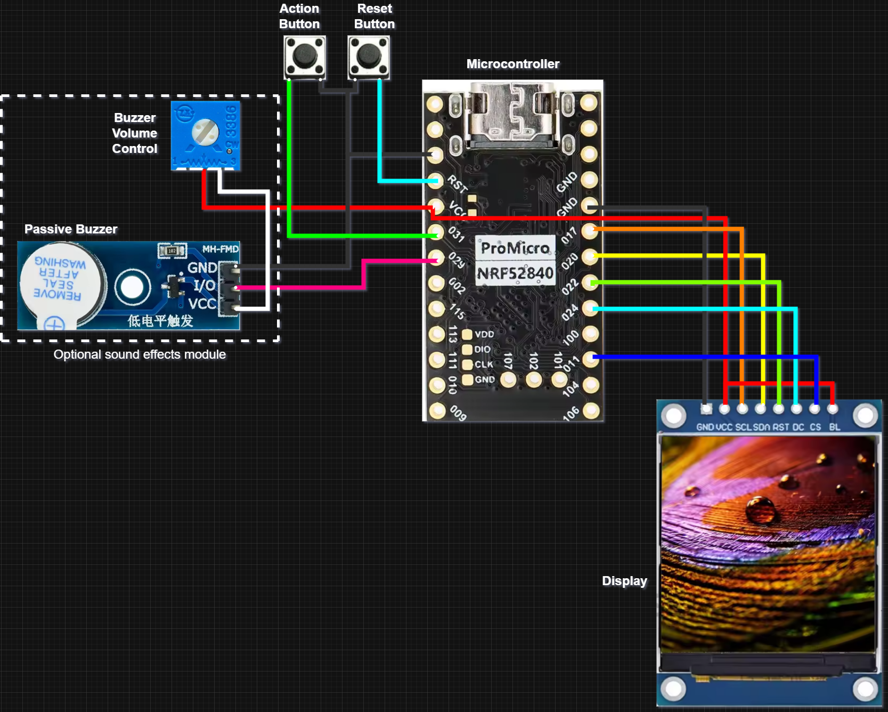

# Hardware



## Bill of materials

| Part | Notes |
| --- | --- |
| nRF52840 ProMicro-compatible board | nice!nano v2, Supermini nRF52840, or equivalent. NEXUS addresses `&gpio0` directly rather than the `pro_micro` nexus, so any board exposing these pins works. |
| ST7789 240x240 IPS TFT | 7-pin SPI module (`GND VCC SCL SDA RST DC CS BL`) or 8-pin with `BL` broken out. |
| Passive buzzer module | MH-FMD or similar. Must be **passive** -- NEXUS drives a waveform, it does not toggle a pin. |
| 10 kΩ potentiometer | Optional, in series with the buzzer. This is the volume control; there is no software volume. |
| Two tactile switches | Action and Reset. |

## Pin map

> **Read this before you solder.** The requirements document contains two
> mappings that disagree on two pins. Section 5 names the wiring diagram as the
> source of truth, so that is what `nexus_dongle.overlay` ships with. If your
> board is wired to the prose table instead, the fix is two lines in the
> overlay, never a source change.

| Signal | Ships as (diagram) | Section 5 table |
| --- | --- | --- |
| ST7789 `SCL` / SCK | **P0.17** | P0.17 |
| ST7789 `SDA` / MOSI | **P0.20** | P0.20 |
| ST7789 `RST` | **P0.22** | P0.22 |
| ST7789 `DC` | **P0.24** | P0.24 |
| ST7789 `CS` | **P0.11** | P0.10 |
| ST7789 `BL` | **tied to VCC** (no GPIO) | P0.11 |
| Buzzer signal | **P0.29** | P0.02 |
| Action button | P0.31 to GND | P0.31 |
| Reset button | MCU `RST` to GND | MCU `RST` |

### Switching to the Section 5 mapping

In `boards/shields/nexus_dongle/nexus_dongle.overlay`:

```dts
&spi3 {
    cs-gpios = <&gpio0 10 GPIO_ACTIVE_LOW>;   /* was 11 */
};
```

uncomment the `nexus_backlight` block and the `nexus-backlight` alias, and
change the PWM pinctrl from `NRF_PSEL(PWM_OUT0, 0, 29)` to
`NRF_PSEL(PWM_OUT0, 0, 2)`.

Everything downstream picks the change up automatically: the backlight HAL
switches from `FIXED` to on/off, the Settings screen starts offering the
brightness row, and no UI or game file changes.

## Backlight

The diagram straps `BL` to VCC, so out of the box there is **no controllable
backlight**. `nexus_display_backlight_set()` returns `-ENODEV` and the
diagnostics screen reports `FIXED`. This is deliberate: Section 10 forbids
claiming brightness control the hardware cannot deliver.

Three levels of support, chosen entirely by devicetree:

| devicetree | Behaviour |
| --- | --- |
| nothing | `FIXED`. Panel sleep still works, backlight timeout does not. |
| `nexus-backlight` alias on a `gpio-leds` child | On/off. `CONFIG_NEXUS_BACKLIGHT_TIMEOUT_S` works. |
| `nexus-backlight-pwm` alias on a `pwm-leds` child | Real brightness, 0-100%. |

## Reset button

Wired directly to the MCU `RST` pin. It is **not** a ZMK key and NEXUS has no
code path anywhere near it (Section 14). It resets the chip when the UI has
crashed, a game has hung, BLE is wedged or USB is in a strange state --
which is exactly the point of having it.

Double-tapping reset on a nice!nano-class board enters the UF2 bootloader.

## Buzzer

The module is driven from `PWM0` channel 0 at 50% duty. Pitch comes from the
PWM period; the sound engine rewrites it per note. A *passive* buzzer is
required -- an active buzzer has its own oscillator and will just beep at one
frequency regardless of what NEXUS asks for.

If you fit the volume pot, put it in series with the buzzer's supply. NEXUS
has no software volume control and does not pretend to.

## SPI

`SPI3` is used rather than `SPI0`/`SPI1`, for two reasons: most ProMicro board
definitions already claim the lower instances, and SPIM3 reaches 32 MHz, which
is what a 240x240 panel needs to be anywhere near 30 FPS.

`MISO` is not connected. The ST7789 is write-only in this design.

## Power

The dongle is USB-powered. It reports no battery of its own; the two battery
cards on the dashboard are the keyboard halves, fetched over the split link.
