# The screens

Every symbol NEXUS puts on the panel, what its states mean, and which button
gets you between them.

Every image on this page is **generated from the firmware source** -- the
fonts, the glyph bitmaps, the palettes and each screen's layout constants are
all read out of the C, and `scripts/render_ui.py` composites them through a
port of the same blend arithmetic. Change a glyph, a colour or a constant and
re-run the script; the pictures change with it, and CI fails if you forget.

They are reconstructions rather than captures -- there is no C compiler in
this repo's toolchain to run the real compositor on the host -- so they are
exact where the data is shared and only as good as the transcription where it
is not. The draw order is the part transcribed by hand.

## Getting around

Seven screens. One button drives all of them.

```
   splash ──► home ◄──────────────► settings ──┬──► diagnostics
              │  ▲                             └──► about
        tap   │  │ hold
              ▼  │
        game center ──tap──► game ──hold──► home
              ▲   │
              └───┘ double-tap: next game
```

| screen | tap | hold | double-tap |
| --- | --- | --- | --- |
| **Home** | Game Center | Settings | -- |
| **Game Center** | play the selected game | Home | next game |
| **Game** | pause / resume / restart | quit to Home | -- |
| **Settings** | move to the next row | activate that row | -- |
| **Diagnostics** | move to the next row | activate that row | -- |
| **About** | back | Home | -- |
| **Splash** | skip | skip | -- |

The lists invert the usual pairing on purpose. With one button, moving is the
thing you do constantly and committing is the thing you do once, so the cheap
gesture is the cursor and the deliberate one is the change -- and it means a
stray tap can never flip a setting. You leave a list through its own `BACK`
row, which is just another row to hold.

`J` / `L` also move the Game Center's selection.

Only the Game Center declares a double-tap, and only it pays for one: a screen
with `btn_double` must hold a single tap back until the window closes
(`CONFIG_NEXUS_BUTTON_DOUBLE_MS`, 280 ms) to find out whether a second is
coming. Everywhere else a tap dispatches the instant the button comes up.

## Home

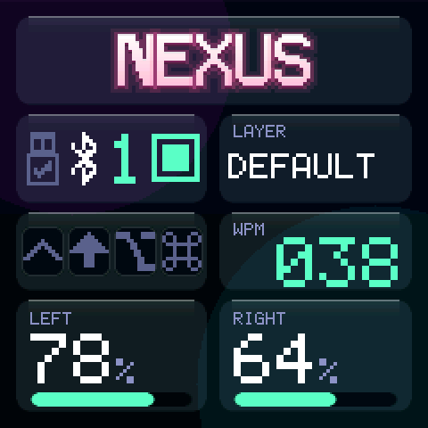

Four rows in a 240x240 square:

- **the brand plate**, carrying the title and nothing else
- **connectivity and layer**
- **modifiers and WPM**
- **both halves' batteries**

The title is drawn as glass -- a near-white face over a soft accent halo (a
one-pixel outline instead, on a light theme), with a one-pixel bevel -- in the
active theme's colours. `CONFIG_NEXUS_PRODUCT` sets
the word; nothing sits under it, deliberately.

Gutters are 5px rather than the usual 7, which is what buys the link row the
height for a readable transport cluster.

<br clear="right">

## Connectivity

Four symbols, read left to right. They answer four separate questions, and
keeping them separate is the point: one highlighted icon cannot say "BLE is
selected but that profile has never paired".

### 1. USB

| | state |
| --- | --- |
|  | **Cable in, HID ready.** The arrow inside the plug is live, and the symbol is in the primary colour -- so USB is also the *selected* transport. |
|  | **Cable in, but BLE is selected.** Same plug, muted. Output is going to a Bluetooth host; USB is only powering the dongle. |
| 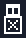 | **Cable in, HID not ready.** The arrow becomes a cross. Usually a charge-only cable, or a host that has not enumerated the keyboard. |

### 2. Bluetooth

The Bluetooth mark is static. Its only job is to say which transport is
selected -- colour carries that, not shape.

| | state |
| --- | --- |
| 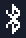 | **BLE is the selected transport.** Primary colour. |
| 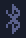 | **USB is selected.** Muted. |

Exactly one of the two transport symbols is ever in the primary colour.

### 3. Profile number

The current BLE profile, 1-5, at the largest text size on the screen -- it is
the thing you check right after `&bt BT_SEL`. NEXUS shows it **one-based**,
while `BT_SEL` takes 0-4: `&bt BT_SEL 0` lights up `1`.

It is drawn in the accent colour on BLE and in the caption colour on USB, so a
profile number you cannot currently use does not look active.

### 4. Profile status

A bordered tile answering "is this profile usable", independently of which
transport is selected.

| | state |
| --- | --- |
| 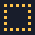 | **Open.** Nothing has ever paired to this profile. Put the host in pairing mode. |
| 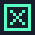 | **Bonded, not connected.** A host is remembered but not here -- asleep, out of range, or connected to something else. |
|  | **Bonded and connected.** Type. |

## Modifiers

Four recessed slots, always all four. An unheld modifier is visibly an *empty
slot* rather than something that failed to draw -- four bare symbols on a flat
panel read as unfinished.

| | held | | idle |
| --- | --- | --- | --- |
|  | **Ctrl** | 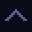 | |
|  | **Shift** |  | |
|  | **Alt** | 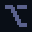 | |
|  | **GUI** |  | |

A held slot changes three things at once -- glyph colour, slot fill and border
-- so it reads without relying on colour alone.

## Settings

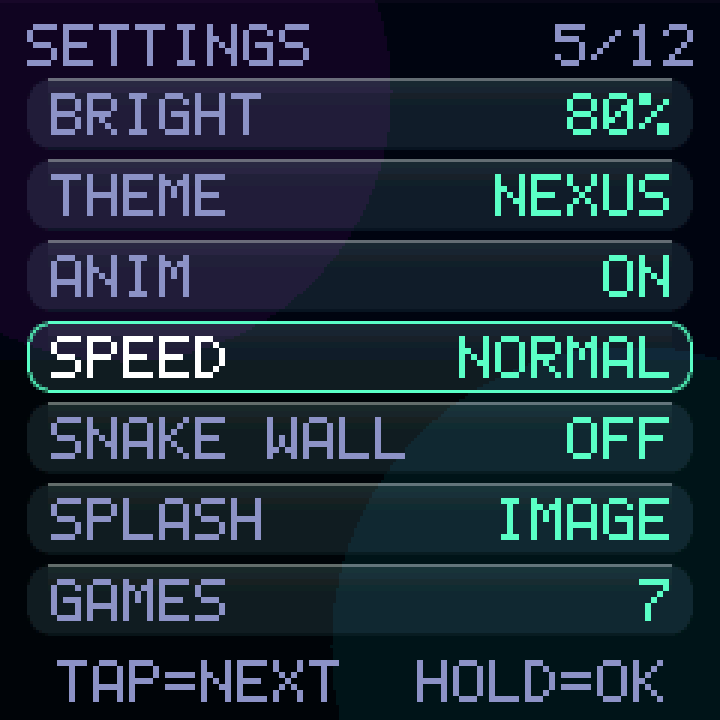

<br clear="right">

| row | does |
| --- | --- |
| `SOUND` | ON / OFF. |
| `BRIGHT` | Backlight level, if the panel has a controllable one. |
| `THEME` | Cycles the seven palettes below. |
| `ANIM` | Whether meters animate to their new value. Read-only display of the build option. |
| `SPEED` | SLOW / EASY / NORMAL / FAST / INSANE / LUDICROUS. Applies to every game with a clock. |
| `SNAKE WALL` | ON = fatal edges, OFF = the board wraps. |
| `SPLASH` | Which splash the build got. Read-only. |
| `GAMES` | How many games are built in. Read-only. |
| `DIAG` | Opens Diagnostics. |
| `ABOUT` | Opens About. |
| `SAVE` | Commits now rather than waiting for the autosave. |
| `BACK` | Leaves the list. |

Everything editable persists to `nexus/ui/prefs` and survives a reflash.
Changes are written after a quiet period (`CONFIG_NEXUS_SETTINGS_AUTOSAVE_MS`,
4 s) so spinning through seven themes costs one flash erase, not seven.

## Diagnostics

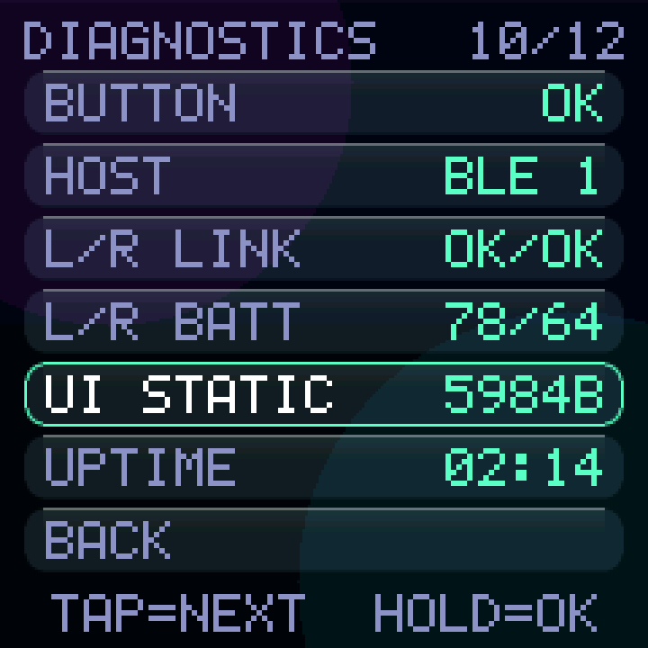

<br clear="right">

`FIRMWARE`, `BOARD`, `DISPLAY`, `BACKLIGHT`, `BUZZER`, `BUTTON`, `HOST`,
`L/R LINK`, `L/R BATT`, `UI STATIC`, `UPTIME`, and `FPS` with
`CONFIG_NEXUS_DEBUG=y`.

`UI STATIC` is the one worth explaining: it is the module's **static RAM
footprint** -- the `.bss` and `.data` NEXUS itself owns -- not free memory and
not the heap. It is a number you compare against itself after a change, which
is exactly what it was added for.

## Themes

`CONFIG_NEXUS_THEME="NAME"`, or cycle them live in Settings. An unknown name
falls back to `NEXUS` rather than failing the build over a typo.

Each strip is that theme's real palette, quantised to the RGB565 the panel
receives -- so these are the colours you get, not the colours the source asks
for.

The same dashboard in all seven:

<p align="center">
  
  
  
  
</p>
<p align="center">
  
  
  
</p>

| palette | | notes |
| --- | --- | --- |
| **NEXUS** | 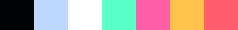 | The default. Deep indigo ground, mint accent, pink alt. |
| **AMOLED** |  | Same language on true black. An OLED burns no power on black, so the gradient and both glow blobs come off. |
| **DAYLIGHT** | 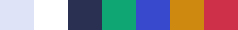 | Light ground. Panes are *brighter* than the background, so the shaded bottom edge does the work the highlight does elsewhere. |
| **CLAY** | 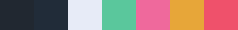 | Neumorphic. Panes are the same colour as the ground and read only through their lit and shaded edges. |
| **ESPRESSO** |  | Warm dark, amber accent. |
| **MINT** |  | Dark green ground, high-chroma mint. |
| **SUNSET** |  | The full-height gradient, violet at the top into amber at the bottom. The clearest demonstration that the pane tint is a real composite: the same panel colour reads violet up top and amber below, because it is. |

Swatch order: `bg_bot`, `panel`, `value`, `accent`, `accent_alt`, `warning`,
`error`.

### The wordmark ramp

Each theme also carries a five-stop ramp for the title, brightest to darkest:
`[0]`/`[1]` shade the face, `[2]` is the halo behind it, `[3]`/`[4]` the two
graded pixels of shade under every edge.

`wordmark_glow_alpha` sets how strongly `[2]` sits behind the letters, and
**zero means outline, not off**: `[2]` is drawn one opaque pixel around the
letterform instead. A halo works because a bright letter plausibly spills
light into a dark ground -- on a light one there is nothing to spill into, and
the same halo reads as the screen being out of focus. Daylight is the theme
that takes the outline; the edge definition is still needed, only the blur is
not.

| | ramp |
| --- | --- |
| NEXUS |  |
| AMOLED |  |
| DAYLIGHT |  |
| CLAY |  |
| ESPRESSO | 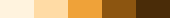 |
| MINT |  |
| SUNSET | 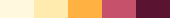 |

See [themes.md](themes.md) for what every field means and how to add a palette.

## Games

<p align="center">
  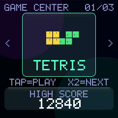
  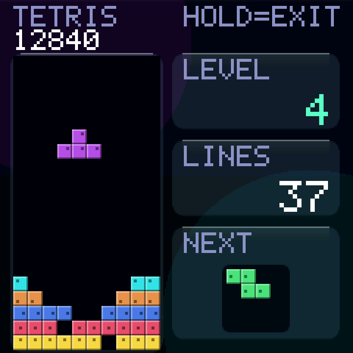
</p>
<p align="center">
  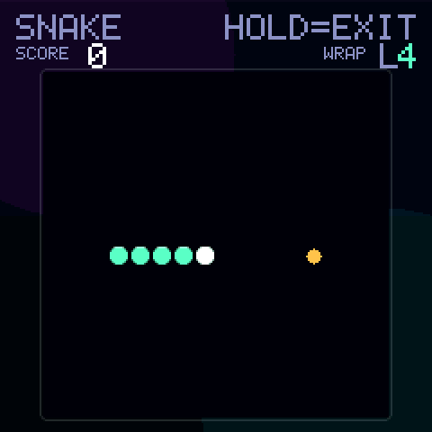
  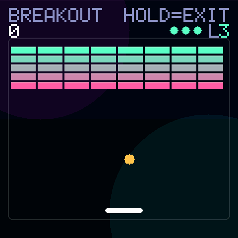
</p>
<p align="center">
  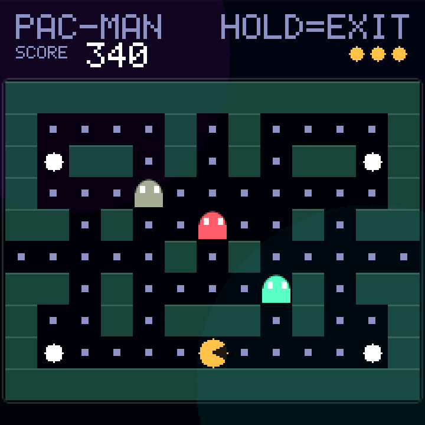
  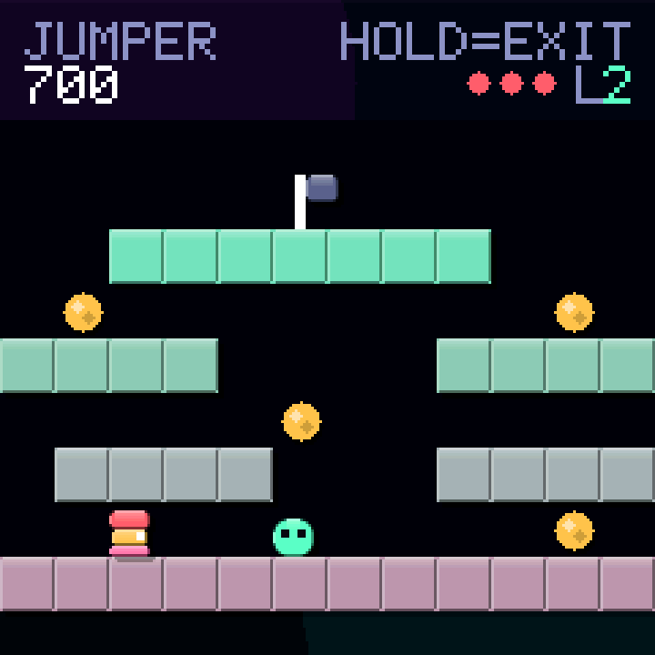
</p>
<p align="center">
  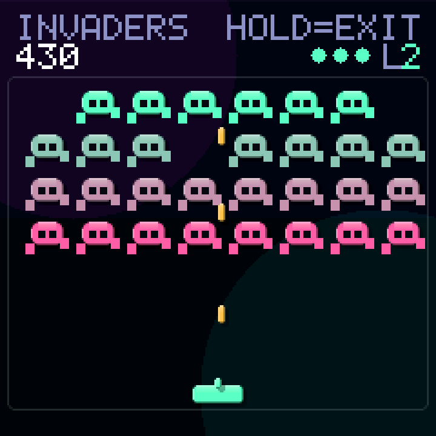
  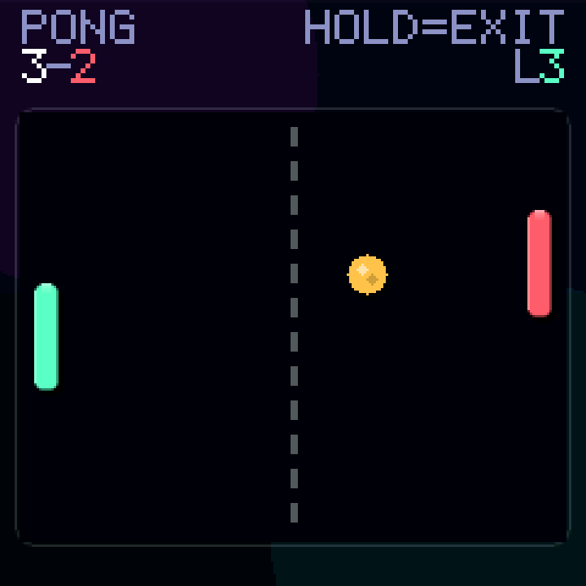
</p>

Seven, all reached from the Game Center. `J`/`L` page between them, the button
plays, double-tap skips to the next one.

| | board | RAM | |
| --- | --- | --- | --- |
| **Tetris** | 10x20 | ~245 B | Seven-bag randomiser, symmetric wall kicks, 100/300/500/800 per 1-4 lines times level. |
| | | | *Every game carries an `L` badge; what advances it is per game - see [games.md](games.md#they-all-have-levels-now).* |
| **Snake** | 16x16 | ~768 B | Walls or wrap, toggled in Settings. Moving into your own vacated tail is legal. |
| **Breakout** | free | ~24 B | 8.8 fixed point, 5x8 bricks, three lives, paddle position steers the ball. |
| **Pac-Man** | 13x10 | ~170 B | 61 dots, four power pellets, three chasers that never reverse, and a wrapping tunnel. |
| **Jumper** | 16x12 | ~90 B | Single-screen platformer, three boards that then wrap. No camera, so only the actors are ever dirty. |
| **Invaders** | 8x4 | ~70 B | A fleet as a bitmask per row, turning on its live extent and speeding up as it thins. Hold to fire, three shots in the air. |
| **Pong** | free | ~30 B | Two paddles and a ball, crossing the court in half a second. The opponent tracks two thirds of the ball's speed, so it is beatable by aiming. |

High scores persist per game and are written only when a record actually
improves. Difficulty is a **runtime** setting, not a build option.

Full rules, controls and tuning: [games.md](games.md).

## Splash

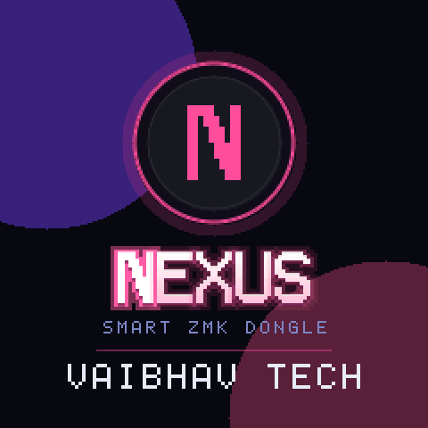

<br clear="right">

Boots into a drawn badge -- two corner discs, a ringed disc with the `N`, the
wordmark, the subtitle, a hairline and the brand -- costing a few hundred bytes
of code rather than the 115,200 the same picture would cost as a PNG.

Point `CONFIG_NEXUS_SPLASH_IMAGE` at your own artwork and it replaces the badge
entirely, text included. See [splash.md](splash.md).

## About

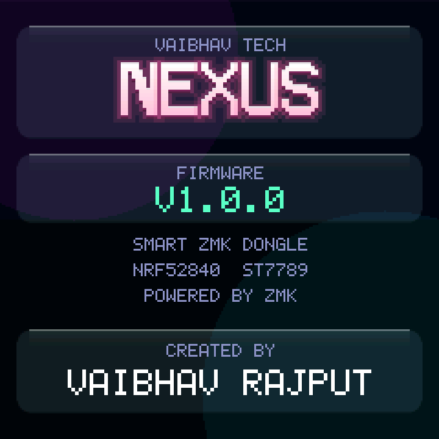

<br clear="right">

Brand, wordmark, firmware version, the hardware it runs on, and the creator
credit. `CONFIG_NEXUS_BRAND`, `_PRODUCT`, `_SUBTITLE` and `_AUTHOR` set the
strings; an empty one hides its line.

## Regenerating these images

```sh
python3 scripts/render_ui.py       # full screens -> docs/images/screens/
python3 scripts/gen_doc_images.py  # glyphs and palettes -> docs/images/ui/
python3 scripts/render_anim.py     # animations    -> docs/images/anim/
```

All three read the firmware source and all three are stdlib only -- no Pillow,
for the same reason `png2c.py` has none, and that includes the GIF encoder in
`scripts/gif.py`. CI runs them and fails on any diff, so an image here cannot
quietly stop matching the code.

The animations are driven by the games' own rules rather than drawn by hand:
Snake frees its tail before the collision test and wraps at the edges,
Breakout runs the same 8.8 fixed-point ball with the paddle deflection that
steers it, and the frame delays are the real tick intervals -- so they play at
the speed the hardware does.

Every frame after the first stores only the rectangle that changed, which is
what keeps a 90-frame Breakout under 40 KB instead of 660. `tests/ui/test_gif.py`
decodes the result with an independent decoder and composites it back, because
a wrong offset there leaves frame 1 perfect and quietly displaces everything
after it.
